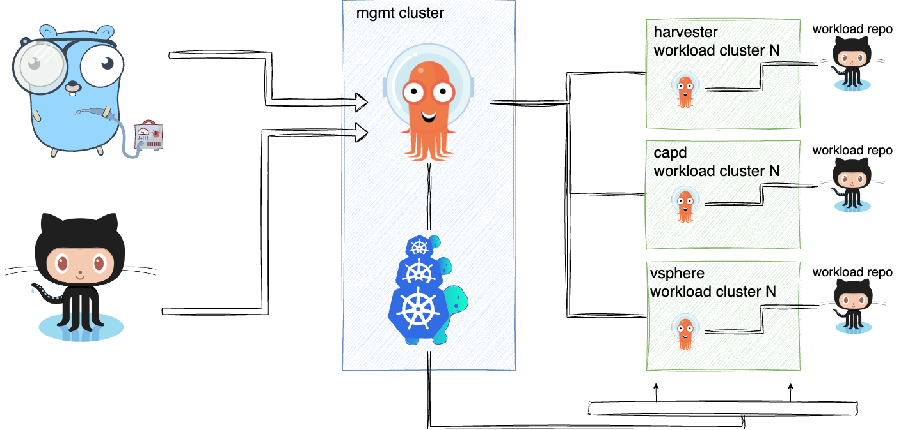

# Frigg

[](https://pkg.go.dev/github.com/PatrickLaabs/frigg)
[](https://goreportcard.com/badge/github.com/PatrickLaabs/frigg)

[](./LICENSE)

## What is Frigg

***Meaning of Frigg**:* Goddess of wisdom and crafts

### **TL;DR**:
With Frigg, you provision **N-Kubernets** Clusters, which are **GitOps**-enabled and have **batteries included**.

Frigg is a cli project, to easily create one to one hundred 
of Kubernetes clusters on different hyperscalers.

[Check the supported Hyperscalers]

No matter which hyperscaler you choose, your kubernetes clusters will be
attached to one another, and are also GitOps enabled.

At the end, you will have N-amount of clusters, with a Github
repository for each of them, where you are able to add more applications deployments.



## Support

You like the project, and want to support further development?
Glad to hear!

<a href="https://www.buymeacoffee.com/patricklaabs" target="_blank"></a>

Thank you very much, for supporting me 🚀

## Get started

- docker
- kind

```
frigg provisions kubernetes cluster with capi and gitops in no-time

Usage:
  frigg [command]

Available Commands:
  bootstrap   bootstrap various clusters on different providers
  completion  Generate the autocompletion script for the specified shell
  delete      Deletes one of [cluster]
  help        Help about any command
  version     Prints the frigg CLI version
```

```
bootstrap various clusters on different providers

Usage:
  frigg bootstrap [flags]
  frigg bootstrap [command]

Available Commands:
  capd        clusterapi provider docker
  capv        capv
  capz        capz
  harvester   harvester
```

```
Creates local Kubernetes clusters using clusterapi's provider capd (docker)

Usage:
  frigg bootstrap capd [flags]
  frigg bootstrap capd [command]

Available Commands:
  cluster         Creates a local Kubernetes cluster
  workloadcluster deploy workload cluster
```

## Features

### Supported Providers
- vCluster
- CAPD (Docker)

### Providers under development
- vSphere
- Azure
- Google
- Harvester
- Proxmox

## Documentation

Further documentation is available in the `/docs` directory.
